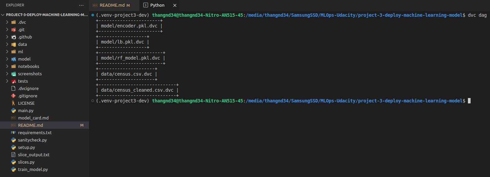
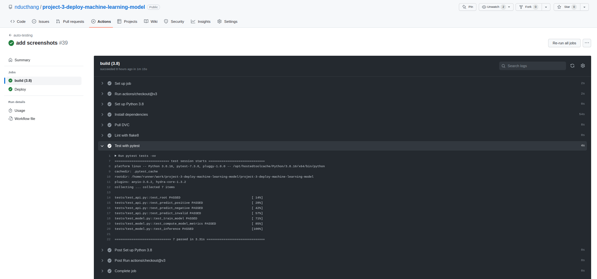

# Project 3: Deploying a ML Model to Cloud Application Platform with FastAPI

## Overview
In this project, you will apply the skills acquired in this course to develop a classification model on publicly available Census Bureau data. You will create unit tests to monitor the model performance on various data slices. Then, you will deploy your model using the FastAPI package and create API tests. The slice validation and the API tests will be incorporated into a CI/CD framework using GitHub Action

## Outputs
### Model Card
[Model card](./model_card.md)
### Slices output
[Slices output](./slice_output.txt)
### DVC DAG

### Continuous Integration

### Continuous Deployment

### FastAPI Docs

### Get Request

### Post Request
